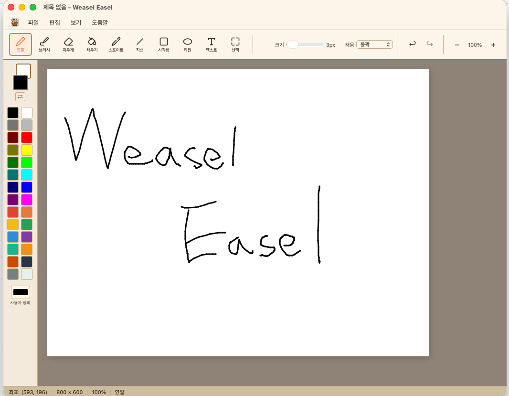

# Weasel Easel

<p align="center">
  
</p>

Windows에는 그림판이 있는데 macOS에는 없다. 그래서 직접 만들었다.

<p align="center">
  
</p>

Weasel Easel은 macOS를 위한 간단한 이미지 편집 도구다. 복잡한 기능 없이, 딱 그림판 수준으로 빠르게 그리고 편집할 수 있다.

## Features

- **Drawing** - 연필, 브러시, 지우개
- **Shapes** - 직선, 사각형, 타원 (윤곽/채움/윤곽+채움)
- **Text** - 캔버스 위에 텍스트 입력
- **Fill** - 페인트 통 (스캔라인 flood fill)
- **Eyedropper** - 캔버스에서 색상 추출
- **Selection** - 사각 선택, 이동, 삭제
- **Color Palette** - 28색 기본 팔레트 + 커스텀 색상
- **Undo/Redo** - 바이트 버짓 기반 동적 히스토리
- **Zoom** - 25% ~ 800%
- **File I/O** - PNG, JPEG 열기/저장 (macOS 네이티브 다이얼로그)

## Usage

### Tools

도구바에서 선택하거나 캔버스 위에서 바로 사용한다.

| 도구 | 설명 |
|------|------|
| 연필 | 자유롭게 선 그리기. 우클릭하면 배경색으로 그린다 |
| 브러시 | 연필보다 굵고 반투명한 획 |
| 지우개 | 흰색으로 덮어서 지운다 |
| 직선 | 드래그로 직선. 놓으면 확정 |
| 사각형 | 드래그로 사각형. 채움 모드 선택 가능 |
| 타원 | 드래그로 타원. 채움 모드 선택 가능 |
| 텍스트 | 클릭하면 입력창 표시. Enter로 확정, Esc로 취소 |
| 채우기 | 클릭한 영역을 전경색으로 채운다 |
| 스포이트 | 클릭한 픽셀의 색상을 전경색으로 가져온다. 우클릭하면 배경색 |
| 선택 | 드래그로 영역 선택. 선택 영역 안을 드래그하면 이동 |

### Color

- 좌측 팔레트에서 **좌클릭 = 전경색**, **우클릭 = 배경색** 설정
- 상단 FG/BG 미리보기 클릭 시 커스텀 색상 선택
- ⇄ 버튼으로 전경/배경 교환

### Toolbar Options

- **크기** 슬라이더: 브러시/선 두께 조절 (1~50px)
- **채움** 드롭다운: 도형의 윤곽 / 채움 / 윤곽+채움 선택
- **줌** +/- 버튼: 캔버스 확대/축소

### Keyboard Shortcuts

| 단축키 | 기능 |
|--------|------|
| `⌘Z` | 실행 취소 |
| `⌘⇧Z` | 다시 실행 |
| `⌘N` | 새로 만들기 |
| `⌘O` | 파일 열기 |
| `⌘S` | 저장 |
| `⌘⇧S` | 다른 이름으로 저장 |
| `⌘A` | 모두 선택 |
| `⌘C` | 복사 |
| `⌘X` | 잘라내기 |
| `⌘V` | 붙여넣기 |
| `⌘+` | 확대 |
| `⌘-` | 축소 |
| `⌘0` | 원본 크기 (100%) |
| `Delete` | 선택 영역 삭제 |

## Tech Stack

- **Tauri v2** - Rust 기반 경량 데스크톱 프레임워크 (앱 크기 ~6MB)
- **HTML5 Canvas** - 트리플 캔버스 아키텍처 (Main / Preview / UI)
- **Vanilla JS** - 프레임워크 없음

## Getting Started

### Prerequisites

- [Rust](https://rustup.rs/)
- [Node.js](https://nodejs.org/) >= 18

### Development

```bash
npm install
npm run tauri dev
```

### Build

```bash
npm run tauri build
```

빌드 결과:
- `src-tauri/target/release/bundle/macos/Weasel Easel.app`
- `src-tauri/target/release/bundle/dmg/Weasel Easel_1.0.0_aarch64.dmg`

## Author

jinho.von.choi@nerdvana.kr
